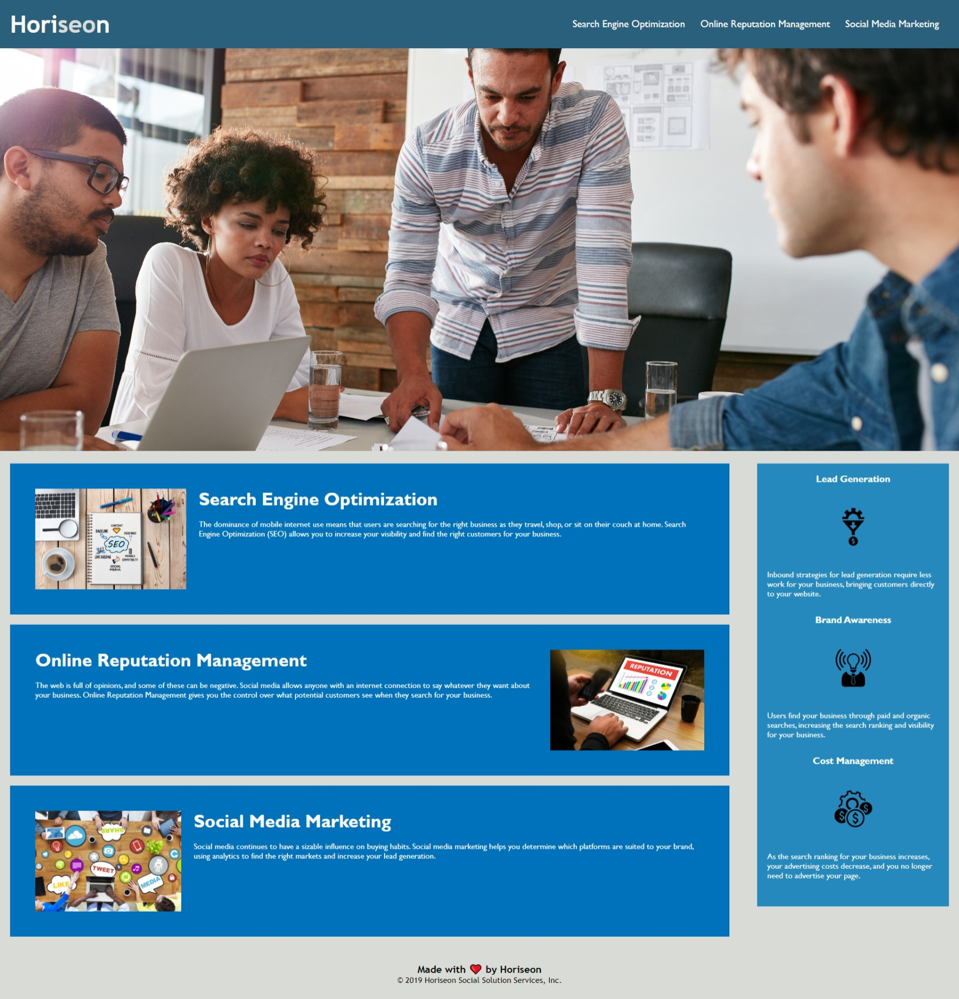

# week1-challenge

## Description

I altered the source code in a few ways to improve accessibility and readability. The div HTML tags were replaced with section tags to make the elements semantic and more accessible to screen readers. I added an id tag to the SEO content card so that the navigation link works. Alt attributes were added to all of the images and icons except for the 'seo' in the horiseon logo so that it is more accessible if the images do not load. A title was added to the webpage so it no longer diplays 'website' as the title. 

The CSS elements were reordered so that they are grouped by section and in the order that they appear in the HTML code. The CSS code was then streamlined to remove duplicate code by replacing unique classes with a single shared class ('card') so that the same formatting only needs to be written once.

## Visual

## URLs

Deployed Application:
https://shippo704.github.io/week1-challenge/challenge/Develop/

Github Repository:
https://github.com/Shippo704/week1-challenge

